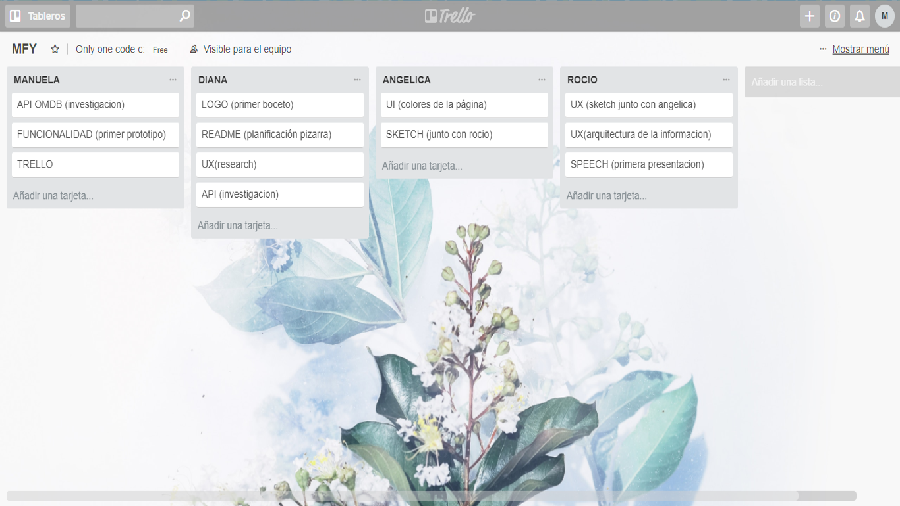

# < ONLY ONE CODE >
## HACKATHON

### TEMATICA: Consumo de películas

### OBJETIVO: Crear soluciones/productos utilizando el API de Open Movie Database (OMDB) o the movie database .

### DIRIGIDO A: consumidores de 17-30 años, que les guste los géneros de terror, comedia, basados en libro y suspenso, y que además prefieren mirar películas desde el 2000 hacia adelante.

### PROYECTO PILOTO: 

### FLUJO DE TRABAJO:

#### 1ST DAY:
  ##### Recursos:
  
  - API de Open Movie Database(OMDB).
  - FRAMWORKS: Bootstrap 4.
  - LIBRERIAS: jQuery.
  - GitHub
  - Trello
  - Slack
  - Google Form
  - HTML 5
  - CSS
  - JavaScript

  ##### Estudio del mercado:
  
  Encuesta realizada mediante Google Form para conocer los intereses de la audiencia.

  ##### Necesidad o Problemática:
  

  ##### Contenido:
  

  #### Retrospectiva:
  #### 1st Day
  - ¿QUÉ HICIMOS BIEN?
   Comunicación,
  - ¿QUÉ PUDIMOS HACER MEJOR?
  - ¿QUÉ COSAS NUEVAS PODEMOS HACER?

  ### Repartición del trabajo:
  #### 1st Day:
  - Manuela de Fátima Flores Vilchez: Investigación del uso del API OMDB.
  - Angelica Villalobos Cabezas: Scketch
  - Edith Rocio Quilla Mamani: Prototipado de baja fidelidad, research, creación de google form.
  - Diana Huamanchay: Investigación del uso del API OMDB y README.

  ### TRELLO DEL DÍA 16.01.18 AL 17.01.18 :

  
