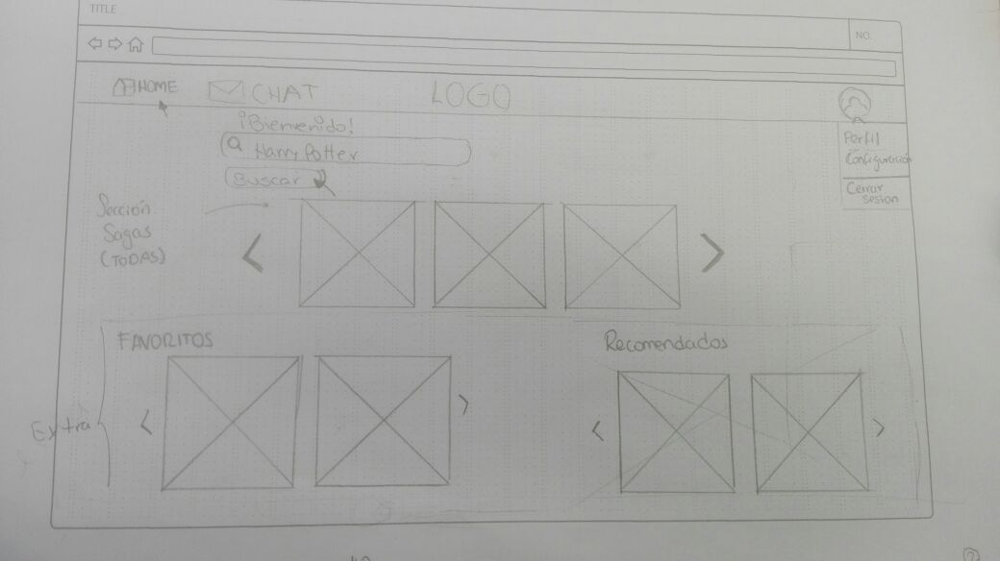
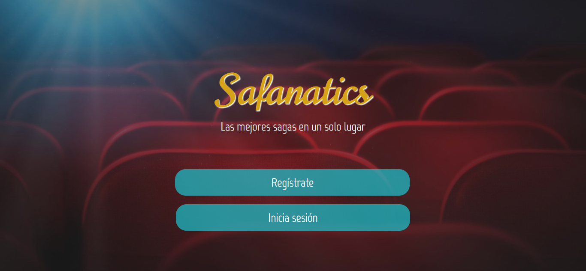
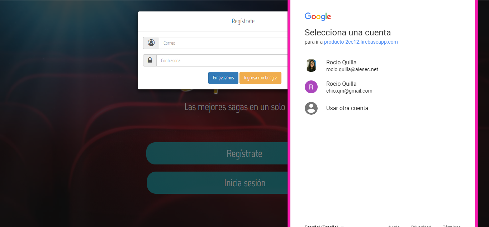
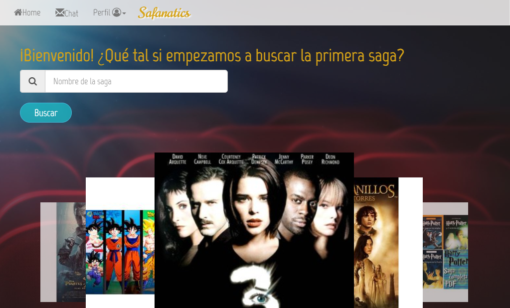
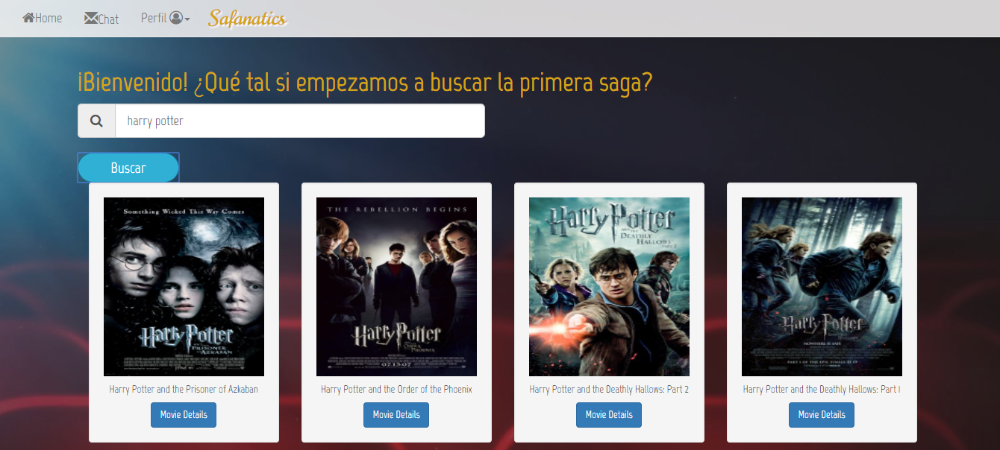
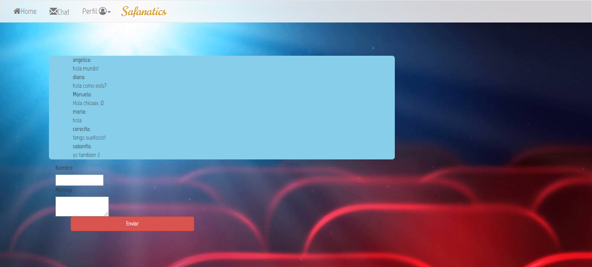

## SAFANATICS

### Tema: Películas

### Objetivo:

Crear soluciones/productos utilizando el API de Open Movie Database (OMDB) o the movie database .

### Dirigido a: 

Personas de 16-30 años, que les guste los géneros de terror, comedia, basados en libro, animadas y suspenso; y que además prefieren mirar películas que sean partes de sagas.

### Recursos: 

 - API Open Movie Database (OMDb).
 - Bootstrap 3.3.7.
 - jQuery.
 - Trello.
 - Firebase.
 - Google Form.
 - HTML 5.
 - CSS 3.
 - Javascript.

### Organización: 

 Mediante el uso de Trello pudimos delegarnos tareas y actividades para poder llevar a cabo este producto en el tiempo pactado.

  

### Prototipado:

Como equipo tuvimos idas y venidas respecto a qué producto realizaríamos, Aquí un breve resumen de la idea inicial y cómo fue evolucionando hasta el producto que hoy presentamos.

#### Idea 1: Movies for Youth

Nuestra idea inicial era crear un buscador de películas, que tuviera una vista home, una vista para realiar búsquedas, otra que te mostrara los cines más cercanos y un perfil.

Sin embargo, la idea nos parecía no solo general sino ya repetida por los buscadores que ya existen en la web. 

Es así como optamos por realizar un pequeño estudio de mercado mediante un google form en el cual nos enfocamos en saber cuáles son los géneros preferidos por el espectador peruano.

 

#### Idea 2: Movies for Youth basado en géneros

Después del pequeño estudio de mercado pudimos deducir que el espectador peruano prefiere 4 géneros: Suspenso, terror, comedias y basados en libros. 

Es así que orientamos nuestro anterior idea a realizar una aplicación que solo te brinde la información de esas películas basadas en esos géneros. 

Además de realizar el sketch, se realizó un [PROYECTO PILOTO](https://manu160296.github.io/testing-movie/) en el cuál pusimos a prueba las funciones que estábamos creando. 

Sin embargo, nuevamente, antes de finalizar el día no estábamos conformes con la idea por que nos parecía ya muy simple. Es así que decidimos darle otro giro y orientarla a ser un buscador que te brinde la información de las sagas más populares del cine. 

#### Idea 3: Safanatics

Teniendo en cuenta el estudio anterior decidimos basar en esas categorías las sagas que vamos a mostrar en el buscador como primer avance. 

Para saber que tiene sentido esta aplicación, relizamos otro google form y nos muestra los siguientes resultados:

Aquí el sketch para esta idea: 

En este primer sketch observamos el index para realizar un log in mmediante google y otras formas soportado por firebase.

Observamos la vista home, en la cual tenemos un buscador, un carrusel en el cual observaremos los pósters de las peliculas mas resaltantes de cada saga.

Si buscamos una saga, nos devuelve los pósters de todas las películas que forman esa saga, y  podremos ver más detalles sobre la película con la siguiente vista.

Por último, la vista del perfil para que el usuario pueda configurar su cuenta. 

### Flujo de Trabajo:

Safanatics es una aplicación en versión mobile y desktop dirigida a personas entre los 16 y 30 años que gusten de mirar sagas y quieran tener información sobre esa saga. 

Esta es la vista principal en la cual vamos a poder registrarnos si somos nuevos en la aplicación o si ya tenemos una cuenta pues iniciamos sesión. 

Como somos nuevos en la aplicación, vamos a registrarnos y como tenemos una cuenta de google ingresamos mediante google. Este inicio se sesión es soportado por **Firebase**. esogiendo la cuenta con la que deseamos ingresar nos dirigimos a la siguiente vista.

En la siguiente vista podemos observar el home, en el cual tenemos un buscador y una barra superior que si nos vamos a los logos nos redirigimos a otras vistas.

Si realizamos la busqueda nos da todos los resultados de esa saga

Y si ingresamos al icono chat, podemos hablar con otros fanaticos de otras sagas a tiempon real.

